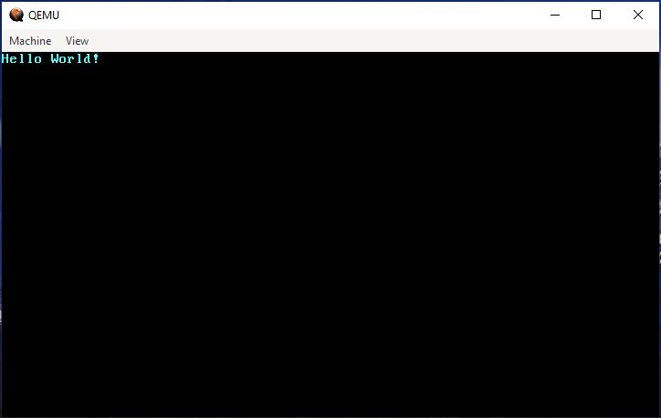

# Running Rust on Metal
First I'd like to shoutout [this series of articles](https://os.phil-opp.com/freestanding-rust-binary/) for a phenomenal introduction to building your own kernel in Rust. It also talks about some tools and crates to make development a little easier and quicker.
## A Basic Kernel
Since a kernel cannot depend on operating system features, it cannot use the standard library as this has some dependencies on the operating system and runs in the user space. The standard library is basically everything that makes writing programs easy, but the result of not using it is a binary capable of being run standalone without an operating system. There's a few hoops to jump through to write a simple program without the standard library. It likely makes sense to introduce the code up front and then walk through what each part is doing.

    #![no_std]
    #![no_main]

    use core::panic::PanicInfo;

    #[panic_handler]
    fn panic(_info: &PanicInfo) -> ! {
        loop {}
    }

    #[no_mangle]
    pub extern "C" fn _start() -> ! {
        loop {}
    }

In Rust we can declare to the compiler that we're not using the standard library by adding the line `#![no_std]` to our main file. The standard library is also where the panic handler is implemented in Rust, so we have to implement our own if we're going to create a standalone binary. We use the `use` keyword to import/rename the PanicInfo struct that the panic handler takes in. In the example above, the panic handler just loops forever. 

In most Rust binaries that use the standard libary, execution begins in `crt0`, which means `C runtime zero`. This runtime then invokes the starting point for the Rust runtime. The Rust runtime does some fancy magic and calls the main function. Running on baremetal, we don't have access to the Rust runtime or `crt0`, so we have to define the entrypoint ourselves. We tell the compiler this with `#![no_main]`. Then we make our actual entrypoint function. We'll call this `_start` as that's what seems to be the standard, and what some tools we'll introduce later are expecting. `#[no_mangle]` just instructs the compiler to not create any sort of unique guid for the function, and to literally call it `_start`. Since we want to be able to call the entrypoint to the kernel, it should be a public function. In Rust, we use `pub` to do this.

The return type of `!` in both `_start` and `panic` indicate that these are diverging functions and don't ever return. In the case that we were to exit, it would be akin to shutting the machine down. The use of `extern "C"` says to use the `C` calling convention. This basically allows us to interact with the binary as if it were written in `C`, which makes testing this much easier.

We also have to tell the compiler that we shouldn't use the C runtime, which can be done by either passing in some arguments or building for a specific architecture. Rust by default tries to build for your current architecture. The command `rustc --version --verbose` gives you a host value that is called a [target triple](https://clang.llvm.org/docs/CrossCompilation.html#target-triple). We have to compile with a target triple that has no underlying operating system, otherwise Rust will try to link it to your current operating system that uses the C runtime. Since I'm doing all of this on `x86_64`, the target triple I want is `x86_64-unknown-none`. I can run `rustup target add x86_64-unknown-none` to download the standard and core library for that target. Then when we build the program, just pass that target in with the command `cargo build --target x86_64-unknown-none`

## Booting
To actually extend into kernel functionality it needs to be able to boot. There's the ability to build my own bootloader here or use a prebuilt tool that builds a bootloader into the project. For the sake of just getting this thing working, I'm going to use [bootimage](https://github.com/rust-osdev/bootimage) until writing a bootloader can go up on the priorities list. This is as simple as adding a dependency on `bootloader = "0.9.23"` in the `cargo.toml` file and running `cargo install bootimage` to install `bootimage`. The latest version of `bootloader` at the time of writing is actually `0.11.3`. I wanted to avoid using an older version of bootloader, since there's a relatively new version out that claims to make implementation much easier (bypasses bootimage altogether). While I did manage to get it to compile, QEMU absolutely hated anything I gave it, and I was never able to successfully write to the VGA buffer or a serial port. After somewhere between 5 and 10 hours of frustration I decided using the older version would have to suffice.

There's a lot of random unstable features that are only included in the nightly builds that are critical to running Rust on metal. Running `rustup override set nightly` should switch you over to the nightly builds of Rust. You can verify you're running nightly builds with `rustc --version`.

To avoid passing in a bunch of command line flags, we're going to make a `json` file that contains the settings we want for building the kernel.

    {
        "llvm-target": "x86_64-unknown-none",
        "data-layout": "e-m:e-i64:64-f80:128-n8:16:32:64-S128",
        "arch": "x86_64",
        "target-endian": "little",
        "target-pointer-width": "64",
        "target-c-int-width": "32",
        "os": "none",
        "executables": true,
        "linker-flavor": "ld.lld",
        "linker": "rust-lld",
        "panic-strategy": "abort",
        "disable-redzone": true,
        "features": "-mmx,-sse,+soft-float"
    }

Then we're going to create a file `.cargo/config.toml` that specifies some of the nightly build features we want to use, as well as where our target file is.

    [unstable]
    build-std-features = ["compiler-builtins-mem"]
    build-std = ["core", "compiler_builtins"]

    [build]
    target = "target.json"

From here it's as simple as running `cargo bootimage` to build the project. The binary output ends up at `target/target/debug/bootimage-rl4.bin`. Running the below command will run the binary in QEMU:
- `qemu-system-x86_64 -drive format=raw,file=target/target/debug/bootimage-rl4.bin`

I also found that if `ctrl + c` doesn't work for stopping qemu, especially when using the `nographic` flag, you can open a different terminal and run `sudo killall qemu-system-x86_64`.

## Hello World

Running the kernel thus far won't actually do anything since it's just sitting in a loop. Fortunately, writing to the VGA text buffer isn't too difficult. We can update the `_start` function to look like this:

    static HELLO: &[u8] = b"Hello World!";

    #[no_mangle]
    pub extern "C" fn _start() -> ! {
        let vga_buffer = 0xb8000 as *mut u8;

        for (i, &byte) in HELLO.iter().enumerate() {
            unsafe {
                *vga_buffer.offset(i as isize * 2) = byte;
                *vga_buffer.offset(i as isize * 2 + 1) = 0xb;
            }
        }
        loop {}
    }

After recompiling the project with `cargo bootimage` and running it on QEMU, the output should look something like this

